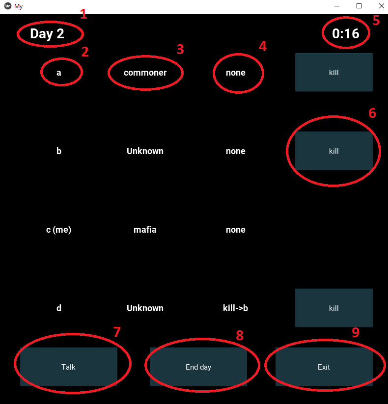

# Mafia
#### New
10.03 - довавлен graphQL сервис со статистикой по играм
### Запуск

```pip install -r Client/requirements.txt```

```python3 Client/app.py```



Немного об интерфейсе

1) Текущее время суток

2) Имена игроков в алфавитном порядке

3) Их роли, если они известны игроку

4) Действия игроков, если они известны (например kill->{name} или end day)

5) Оставшееся время до смены дня/ночи

6) Действия kill/check (для комиссара)

7) Говорить при помощи аудиочата

8) Пропустить свой ход

9) Выйти из игры (то же самое, что нажать крестик, Alt-f4).

Ссылка на docker-образ сервера: https://hub.docker.com/repository/docker/vetand2013/mafia-game

Для начала игры необходимо 4 игрока (2x commoner, commissar, mafia).

### Архитектура решения

Архитектура сервера состоит из трёх основный частей:

##### Комната ожидания

Комната ожидания является основной точкой входа в игру. gRPC сервер слушает порт #50051 и принимает запросы на подключение к игровой сессии. В качестве ответа клиенту он предоставляет сведения о других пользователях, находящихся в комнате ожидания, а также число недостающих для заполнения комнаты игроков.

В момент, когда число игроков достигает необходимого количество (4 человека), комната ожидания открывает новый процесс (при помощи Popen) с движком игры. Информация о местонахождении этой комнаты отправляется клиенту при следующем запросе.

Интерфейс взаимодействия с этой комнатой описан в файле `wait_room_requests.proto`.

##### Игровая комната

Ещё один gRPC сервер, работающий на одном из портов #50052-#50054, в зависимости от номера комнаты. Коммуникация с пользователями осуществляется посредством единичных RPC запросов со стороны клиента. Первый тип запросов -  `Heartbeat`, при помощи которого клиент поддерживает связь с сервером, получая взамен необходимые данные о состоянии игры (объект `state`).
Ещё один запрос - `Set action`, с помощью которого клиент уведомляет сервер о действиях игрока.

Всего возможно ведение трёх сессий одновременно. В противном случае, сервер откажет в регистрации клиенту.

Интерфейс взаимодействия с этой комнатой описан в файле `play_room_requests.proto`.

##### Аудио чат

Использован чат из предыдущей работы. Клиент подключается к серверу при начале игровой сессии. Занимает порты #50055-50057.

##### REST сервер со статистикой

Для каждого игрока подсчитывается статистика (количество игр, побед, поражений, время в игре), хранящаяся в SQL базе данных на REST сервере.
После окончания игры, игровая комната посылает на этот сервер запрос с результатами игры для каждого участника.
Сервер позволяет получать эту статистику в виде .pdf файла.
